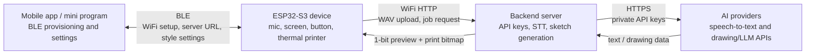

# Voice Sketch Printer Architecture

This document records the planned product architecture for the voice-to-sketch
thermal printer project. The current Python bridge is treated as a local
development server. It should gradually evolve into the real backend service.

## Goal

The final device should let a user press a button, speak a drawing request, see
a black-and-white preview on the screen, and print the result on thermal paper.

```text
voice -> speech to text -> sketch generation -> screen preview -> thermal print
```

## Recommended Final Architecture



## Responsibilities

### ESP32-S3 Device

- Records audio from the INMP441 microphone.
- Shows WiFi, recording, thinking, and sketch preview states on the ST7789.
- Sends WAV audio to the backend over WiFi.
- Receives one-bit bitmap data for screen preview.
- Later sends a one-bit 384-dot-wide bitmap to the thermal printer.
- Stores only device configuration such as WiFi credentials and server URL.
- Must not store AI API keys.

### Mobile App Or Mini Program

- Finds the device over BLE.
- Sends WiFi SSID/password to the device during setup.
- Sends backend server URL and user settings such as drawing style.
- Shows simple device status and allows reset/reconfigure actions.
- May show history later, but should not be required for the core print flow.

### Backend Server

- Stores AI provider API keys.
- Accepts WAV audio from the ESP32.
- Calls speech-to-text.
- Converts the recognized text into a simple black-and-white sketch.
- Produces two bitmap targets:
  - screen preview bitmap, currently 160x160, one bit per pixel.
  - printer bitmap, later 384 dots wide for the thermal printer.
- Saves debug artifacts during development, including uploaded WAV files and
  generated PBM images.

## Why Use A Server Instead Of Phone-Only AI

- API keys are safer on a backend than inside a mobile app or mini program.
- BLE is good for setup and small commands, but awkward for repeated audio or
  bitmap transfer.
- ESP32 can upload audio over WiFi much more naturally than pushing audio to a
  phone over BLE.
- A backend makes the graduation project easier to explain: device, mobile
  configuration, and cloud AI service are clearly separated.

## Current Development Server

`tools/stt_bridge_openai.py` is the current local fake server.

Current endpoints:

| Endpoint | Purpose |
| --- | --- |
| `GET /health` | Check whether the local server is running. |
| `GET /draw?text=cat` | Generate a demo sketch without recording audio. |
| `POST /stt` | Accept `audio/wav`, run STT, generate a sketch, return JSON. |

Current response shape for sketch-capable calls:

```json
{
  "text": "画一只猫",
  "image": {
    "width": 160,
    "height": 160,
    "format": "1bpp_hex_msb_black1",
    "title": "cat",
    "bitmap": "..."
  }
}
```

The current sketch generator is intentionally a placeholder. It uses local
rules for common words like cat, dog, house, tree, flower, car, fish, person,
mountain, and star. This keeps the ESP32 screen pipeline stable before adding
real AI drawing.

## Server Roadmap

1. Keep the current Python server as the development backend.
2. Add a stable response contract for both preview and printer bitmaps.
3. Generate and save a 384-dot-wide printer PBM even before the printer arrives.
4. Replace the local rule-based sketch generator with an AI line-art generator.
5. Add a job folder or tiny database for history and debugging.
6. Add BLE-based configuration later so the mobile app can set WiFi and server
   URL without editing firmware headers.
7. Deploy the Python backend to a real server or package it as a local demo
   service for graduation presentation.

## Near-Term Implementation Order

1. Print path preparation: make the server create a 384-dot-wide print bitmap.
2. Thermal printer bring-up: send text first, then bitmap.
3. AI sketch provider: use the recognized text to produce better line art.
4. BLE provisioning: let the phone configure WiFi and server URL.
5. Enclosure and PCB: finalize only after the printer, screen, button, and power
   layout are physically confirmed.
